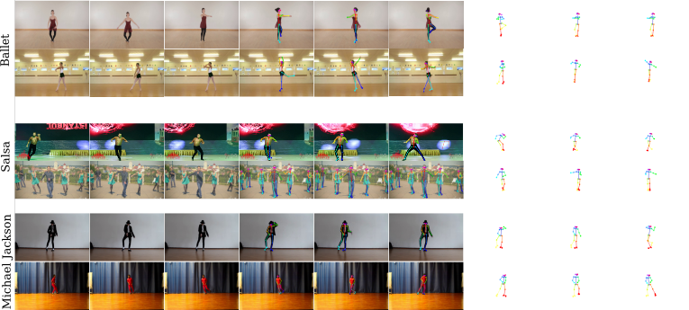

[](LICENSE)
[](https://colab.research.google.com/drive/1Oquzbp_atXK_9jhjSo18snSk2lHn-sIk?usp=sharing)

## <b>L2D: Learning to dance from music audio</b> <br>[[Project Page]](https://verlab.github.io/Learning2Dance_CAG_2020/) [[Paper]](https://doi.org/10.1016/j.cag.2020.09.009) [[Video]](https://www.youtube.com/watch?v=fGDK6UkKzvA)

PyTorch implementation of **L2D** multi-modal graph convolutional adversarial network model to generate human motion from music. The project webpage of the paper is [https://verlab.github.io/Learning2Dance_CAG_2020/](https://verlab.github.io/Learning2Dance_CAG_2020/)


## Introduction

This repository contains the original implementation of the [L2D paper](https://doi.org/10.1016/j.cag.2020.09.009): **"Learning to dance: A graph convolutional adversarial network to generate realistic dance motions from audio"**. 

We design a human motion generation method based on graph convolutional networks (GCN) to tackle the problem of automatic dance generation from audio information. Our method uses an adversarial learning scheme conditioned on the input music audios to create natural motions preserving the key movements of different music styles. 

Please cite L2D in your publications if it helps your research:

```
@article{ferreira2020cag,
title = {Learning to dance: A graph convolutional adversarial network to generate realistic dance motions from audio},
journal = {Computers \& Graphics},
volume = {94},
pages = {11 - 21},
year = {2021},
issn = {0097-8493},
doi =  {10.1016/j.cag.2020.09.009},
author = {J. P. {Ferreira} and T. M. {Coutinho} and T. L. {Gomes} and J. F. {Neto} and R. {Azevedo} and R. {Martins} and E. R. {Nascimento}}}
```

## Setup and Installation 

There are three possible ways to setup your enviroment to run and to train the model. We recommend using the **container** options (cases I and II) to avoid issues with system dependencies.

### Case I - Building in a Singularity container:

  To build a [Singularity](https://sylabs.io/docs/) container you should have singularity installed in your system with minimum version 2.3. Then you must move the files ```requirements.txt``` and ```singularity``` to the folder where you want to build your container, then run on the folder with the files:

  ```shell
  sudo singularity build NAME_YOUR_CONATINER singularity
  ```
  Also you should take a look in some building flags of singularity (_e.g._ ```--sandbox``` or ```--notest```)

### Case II - Building a Docker container:

  To build and use the code with Docker, please run the following command in the ```setup``` folder containing the provided Dockerfile:

  ```shell
  docker build -t NAME_YOUR_IMAGE .
  ```
  After building the docker image, you can acess the shell prompt from the image using the following command:

  ```shell
  docker container run -it NAME_YOUR_IMAGE /bin/bash
  ```
 
### Case III - Installing on your own system (not recommended):
  You must have installed CUDA and CUDNN with compatible versions with PyTorch 1.4. We use CUDA in version 10.1 and CUDNN in version 7. You can use the cpu version of torch, however you probably have to solve some issues on the requirements.

  ```shell
  sudo apt update -y && sudo apt upgrade -y sudo apt install python3-pip ffmpeg -y && sudo pip install -r setup/requirements.txt
  ```

## Motion Generation

* To generate motion using our pre-trained weights you must specify the path of the weights for both audio classifier and motion generator networks. You can download the weights [here](https://github.com/verlab/Learning2Dance_CAG_2020/blob/master/weights/generator.pt) or [here](https://github.com/verlab/Learning2Dance_CAG_2020/blob/master/weights/audio_classifier.pt). Or you can get the weights in the folder ```/weights```.

* The command to test our method is as follows:
```shell
python main.py -p test --input PATH_TO_AUDIO.WAV --cpk_path PATH_TO_GENERATOR_WEIGHTS.pt --audio_ckp PATH_TO_AUDIO_CLASSIFIER_WEIGHTS.pt --out_video PATH_TO_SAVE_OUTPUT_FILES
```

* Other useful parameters can be seen using the flag ```--help```. However please notice most parameters are not used in the test phase.

* We also shared a Google colabotory example, the link is the begining of this README or you can acess from [here](https://colab.research.google.com/drive/1Oquzbp_atXK_9jhjSo18snSk2lHn-sIk?usp=sharing).

### Training

* To train the networks with our dataset, or with your own data, you must have a dataset following the structure described [here](./dataset_tools/README.md). You can download the provided dataset following the instructions [here](./dataset.md)

* For training the networks:
```shell
python main.py -p train -d PATH_TO_DATSET --ckp_save_path PATH_TO_SAVE_WEIGHTS
```

* Other useful parameters can be seen using the flag ```--help```.

## Dataset

Please check our dataset (videos, audios) [DATASET.md](dataset.md) and provided data tools in [DATASET_TOOLS.md](dataset_tools/README.md) for detailed instructions.



### License \& Disclaimer
This is research code, expect that it can change and any fitness for a particular purpose is disclaimed.
This software is under GNU General Public License Version 3 ([GPLv3](LICENSE)).


<br/>
