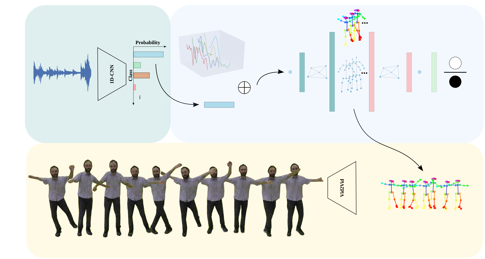

## <b>L2D: Learning to dance from music audio</b> <br>[[Project Page]](https://www.verlab.dcc.ufmg.br/motion-analysis/cag2020/) [[Paper]](https://doi.org/10.1016/j.cag.2020.09.009) [[Video]](https://www.youtube.com/watch?v=fGDK6UkKzvA)



Pytorch implementation of our multi-modal graph convolutional adversarial network model to generate human motion from music.

## Introduction

This repository contains the original implementation of the [paper](https://doi.org/10.1016/j.cag.2020.09.009): "Learning to dance: A graph convolutional adversarial network to generate realistic dance motions from audio". We design a novel human motion generation method based on graph convolutional networks (GCN) to tackle the problem of automatic dance generation from audio information. Our method uses an adversarial learning scheme conditioned on the input music audios to create natural motions preserving the key movements of different music styles. 

Please follow the install and setup instructions to train and test our motion generation model from sound data. This is research code, expect that it can change and any fitness for a particular purpose is disclaimed.

Please cite L2D in your publications if it helps your research:

```
@article{ferreira2020cag,
  author = “João P. Ferreira and Thiago M. Coutinho and Thiago L. Gomes and José F. Neto and Rafael Azevedo and Renato Martins and Erickson R. Nascimento”,
  title = “Learning to dance: A graph convolutional adversarial network to generate realistic dance motions from audio”,
  journal = “Computers & Graphics”,
  volume = “94”,
  pages = “11 – 21”,
  year = “2021”,
  issn = “0097-8493”,
  doi = “https://doi.org/10.1016/j.cag.2020.09.009”,
}
```

## Setup and Installation 

* There are 3 ways to setup your enviroment to run learning to dance framework. We recommend use an conatiner to avoid issues with system depencies.
### 1 - Installing on your own system:
  You must have installed CUDA and CUDNN with compatible versions with PyTorch 1.4. We use CUDA in version 10.1 and CUDNN in version 7. You can use the cpu version of torch, however you probably have to solve some issues on the requirements.

  ```sudo apt update -y && sudo apt upgrade -y sudo apt install python3-pip ffmpeg -y && sudo pip install -r setup/requirements.txt```
### 2 - Build a Singularity container:
  To build a [Singularity](https://sylabs.io/docs/) conatiner you should have singularity installed in your system at minimum version 2.3. Then you must move the files ```requirements.txt``` and ```singularity``` to the folder we want to build your contanier, then run on the folder you just copy the files:

  ```sudo singularity build NAME_YOUR_CONATINER singularity```

  Also you should take a look in some build flags of singularity (_e.g._ ```--sandbox``` or ```--notest```)

### 3 - Build a Dcoker container:

  To build de image using the Dockerfile run the following command in the ```setup``` folder:

  ```docker build -t NAME_YOUR_IMAGE .```

  After the process of build an image finish, you can acess an shell prompt from the image, creating an container and using the following command:

  ```docker container run -it NAME_YOUR_IMAGE /bin/bash```

## Motion Generation

* To generate motion using our pre-trained weights you must specify the path of the weights for both, the audio classifier and the generator networks. You can download the wieghts [here]() or [here](). Or you can get the weights in the folder ```/weights```.

* The command to test our method is as follow:
```python main.py -p test --input PATH_TO_AUDIO.WAV --cpk_path PATH_TO_GENERATOR_WEIGHTS.pt --audio_ckp PATH_TO_AUDIO_CLASSIFIER_WEIGHTS.pt --out_video PATH_TO_SAVE_OUTPUT_FILES```

* Other useful parameters can be seen using the flag ```--help```. However not every parameter is used in the test phase.

### Training

* To train our method you must have a dataset following the structure describe [here](./dataset_tools/README.md). Alternatively you can download you dataset following the instructions [here](./dataset.md)

* The command to train you method is as follow:
```python main.py -p train -d PATH_TO_DATSET --ckp_save_path PATH_TO_SAVE_WEIGHTS```

* Other useful parameters can be seen using the flag ```--help```. However not every parameter is used in the train phase.


<br/>
