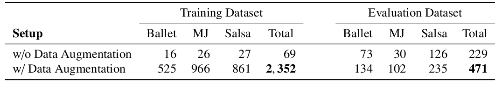

<link rel="stylesheet" type="./docs/assets/style.css" media="all" href="URL" />


<br/>
<br/>
<br/>
<br/>
<hr>

<h1 align="center"> <b>Learning to Dance - Dataset </b></h1>


# Download:

## Downloading all data
* Please take a look at the ```dataset_tools/download_data.sh```

## Downloading separately data
* You can download our train dataset in the [link](verlab.dcc.ufmg.br/l2d/datasets/l2d_train.tar.gz)
* You can download our evaluation dataset in the [link](verlab.dcc.ufmg.br/l2d/datasets/l2d_eval.tar.gz)
* You can download the url to the videos we use to train our audio classifier in the [link](verlab.dcc.ufmg.br/l2d/datasets/l2d_audios.zip)

## Alternative Download
Alternatively you can download our datasets using this [link](https://drive.google.com/drive/folders/12h6f5Y_Qxq5U40hBUuUCLltrSLONiXin?usp=sharing)

# Dataset Information:

* The Table below show the number of samples in the dataset. 


